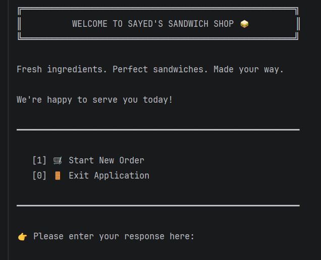
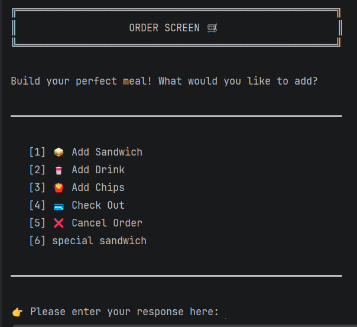
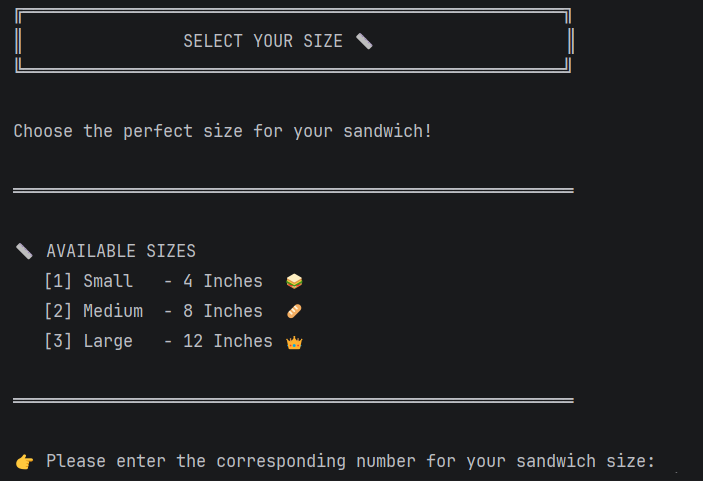
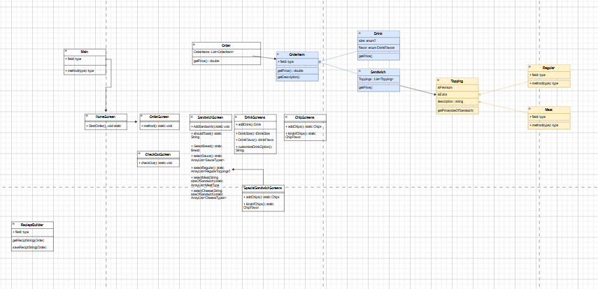
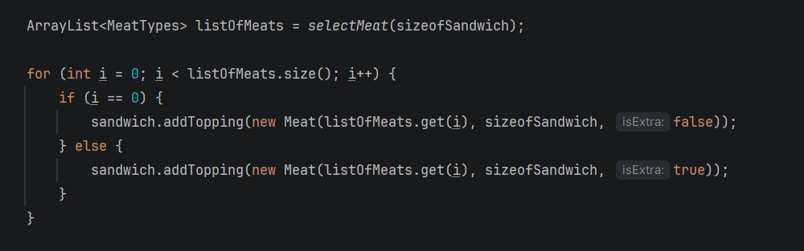

# Sayed's Sandwich Shop Application

A professional, object-oriented Command Line Interface (CLI) Point-of-Sale (POS) system built in Java. This application allows users to build completely customized sandwich meals, order pre-configured premium chef recipes, add sides/drinks with special instructions, and generate formatted physical receipts with accurate transactional pricing logic.

---

## Application Preview

### Home Screen
The landing portal of the terminal application welcome screen.


### Order Management Hub
The central interface for selecting custom items, tracking items, and initializing checkout paths.


### Custom Configuration Flow
Deep customization screens featuring structural constraints like bread, premium additions, sizes, and specific flags such as toasting.


---

## Architecture & System Design

The application heavily utilizes classic Object-Oriented Programming (OOP) principles including Inheritance, Encapsulation, and Polymorphism. All items inherit from a base OrderItem interface or abstract class, allowing the application to process prices and descriptions polymorphically.

### Class Diagram
The full relationship structure and programmatic data flow are detailed in the schematic below:



### Project Directory Layout
The project package structure splits responsibilities strictly between models, UI layouts, enums, and data processing services:


---

## Detailed Application Workflow

When you run the application, the execution flow strictly follows these operational phases:

### 1. Home Screen
The application initializes at the Home Screen, acting as the primary entry gate. The user is presented with two options:
* **Start New Order:** Allocates a new session order and forwards the user to the Order Screen.
* **Exit Application:** Safely terminates the program execution.

### 2. Order Screen (The Hub)
Once an order is active, the user enters the central Order Screen Hub. This screen manages the active shopping cart and offers 6 core workflows:
* **Add Sandwich:** Routes to the custom sandwich creation pipeline.
* **Add Drink:** Routes to the custom beverage customization step.
* **Add Chips:** Routes to the quick chip selection menu.
* **Special Sandwich:** Opens the premium signature recipe selection screen.
* **Check Out:** Forwards the current collection of items to the checkout and order confirmation process.
* **Cancel Order:** Completely clears all current items from memory and resets the application back to the Home Screen.

### 3. Sandwich Customization Screen
The standard sandwich screen allows a user to build a custom order from scratch by collecting data through sequential menus:
* **Size:** Small (4-inch), Medium (8-inch), or Large (12-inch). Sizing dynamically sets base prices and scales premium topping rates.
* **Bread Type:** Select from options such as White, Wheat, Rye, or Wrap.
* **Toasting Preference:** Asks whether the user wants the sandwich toasted (Yes/No).
* **Toppings Pipeline:** Sequential entry steps to accumulate ingredients:
    * Meats: Premium additions with flags to mark regular or extra portions.
    * Cheeses: Premium options with regular or extra portion configurations.
    * Veggies: Regular free toppings added into the order loop.
    * Sauces: Condiment selections with utility options to clear choices.

### 4. Drink Selection Screen
The beverage menu captures drink parameters along with specialized requests:
* **Size:** Select between Small, Medium, or Large sizing configurations.
* **Flavor:** Choose from available drink varieties managed by the underlying systems.
* **Special Requests:** Custom modifications can be added to the item, including adding extra ice, requesting no ice, or adding a fresh lemon slice.

### 5. Chips Selection Screen
A quick standalone side menu that queries the user for a single parameter:
* **Flavor Selection:** Prompts the user with specific chip inventory choices and instantly attaches the item to the running order list upon selection.

### 6. Special Sandwiches Screen
Designed for rapid or premium ordering, this screen contains pre-configured recipes like Sayed's Special Sandwich or the Monster Sandwich:
* **As-Is Order:** Instantly populates a Large sandwich with default premium items, meats, cheeses, and sauces, and appends it to the order.
* **Customization Option:** Automatically loads the signature base but opens the standard customization loop, allowing the user to add or modify toppings before finalizing.

### 7. Checkout & Confirmation Path
* **Review Screen:** Displays an itemized description and total cost breakdown for everything currently added.
* **Confirm Order:** Invokes the ReceiptBuilder service to format and save a permanent physical .txt receipt file, outputs the confirmation text, and gracefully clears data to return to the Home Screen.

### Piece of Code that I am proud of
I am proud of this piece of code because it took me a very long time to figure out.

---

## Robust Input Validation
To maximize reliability, all menus run inside automated validation structures:
* Integer inputs are safely processed through a wrapper utility to filter out text entry errors.
* Selection options utilize default handling blocks within switch cases. If an invalid or out-of-bounds choice code is processed, the system prints a clear warning and keeps the menu context active so the user can re-prompt without crashing.

---

## Getting Started

### Prerequisites
* **Java Development Kit (JDK 17 or higher)**
* **Apache Maven**

### Installation & Execution
1. Clone the repository to your local system:
```bash
   git clone [https://github.com/yourusername/Sayeds-Sandwich-Shop-Application.git](https://github.com/yourusername/Sayeds-Sandwich-Shop-Application.git)